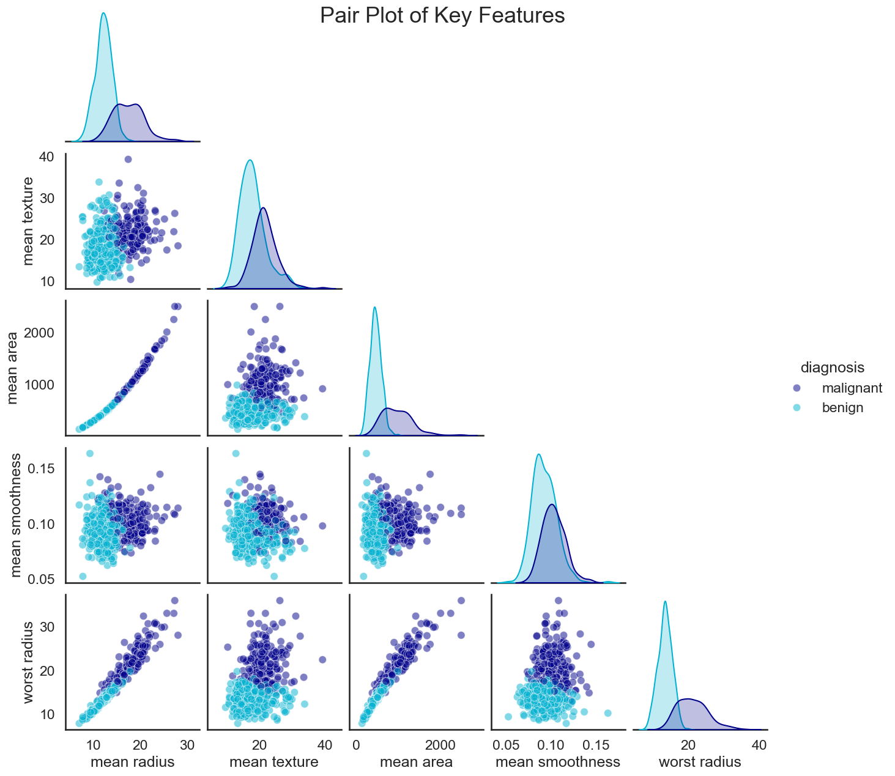
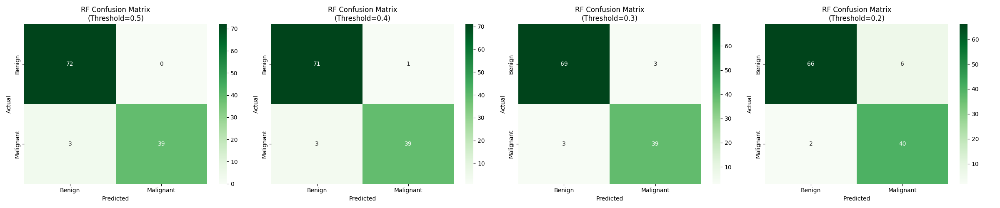
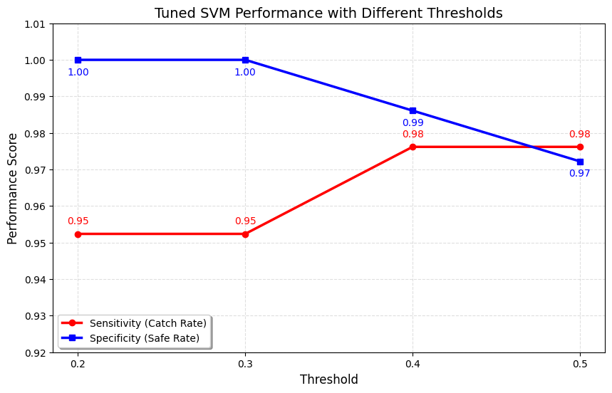

# Breast Cancer ML Classifier

A machine learning classifier to assist radiologists in distinguishing malignant from benign breast masses using cell nucleus morphology features.

---

## Business Question

> Can we develop a machine learning model that uses cell morphology features to help radiologists differentiate malignant from benign breast masses, thereby reducing unnecessary biopsies without compromising cancer detection rates?

---

## Repository Structure

```
breast-cancer-classifier/
├── .github
│   ├── issue_template.yaml
│   └── pull_request_template.md
├── .vscode
│   └── settings.json
├── data
│   ├── processed
│   └── raw
├── notebooks
│   ├── 01_eda.ipynb
│   ├── 02_model_comparison.ipynb
│   └── 02_preprocessing.ipynb
├── reports
│   └── figures
├── src
│   ├── __init__.py
│   ├── compare.py
│   ├── evaluate.py
│   ├── generate_tree.py
│   ├── pipelines.py
│   ├── preprocessing.py
│   ├── train.py
│   └── tune.py
├── .gitignore
├── LICENSE
├── pyproject.toml
├── README.md
├── repo_structure.md
├── repo_workflow.md
└── SETUP.md
```

---

## Dataset

- **Source:** [UCI ML Repository — Wisconsin Breast Cancer Diagnostic](https://archive.ics.uci.edu/dataset/17/breast+cancer+wisconsin+diagnostic)
- **Samples:** 569 patients
- **Features:** 30 continuous features derived from digitized FNA (fine needle aspirate) images
- **Target:** Binary — Malignant (212) / Benign (357)
- **Feature groups:** Each of 10 nucleus measurements (radius, texture, perimeter, area, smoothness, compactness, concavity, concave points, symmetry, fractal dimension) captured as mean, standard error, and worst value
- **Data quality:** No missing values

---

## Methodology

1. **Data Cleaning** — Missing value check, duplicate detection, outlier analysis (IQR)
2. **EDA** — Data quality check, class imbalance, correlation/multicollinearity analysis, pair plots, PCA
3. **Preprocessing** — Target encoding, StandardScaler normalization, stratified 80/20 train-test split
4. **Baseline Model** — Logistic Regression with both L1 (Lasso) and L2 (Ridge) penalties compared
5. **Advanced Models** — Random Forest, Support Vector Machine (SVM)
6. **Hyperparameter Tuning** — GridSearchCV with 10-fold cross-validation, optimized for recall; for Logistic Regression, penalty (L1/L2) and regularization strength (C) were included in the search grid
7. **Evaluation** — AUC-ROC curves, confusion matrices, feature importance, threshold tuning

---

## EDA Summary

The dataset is clean and well-structured (569 rows, 30 numeric features, binary target) with no missing values, duplicates, or zero-variance features. Classes are moderately imbalanced (~63% benign), so stratified splitting and sensitivity/specificity metrics are preferred over accuracy.

Multicollinearity is a key concern — correlated features like radius, perimeter, and area will require L1/L2 regularization and `StandardScaler()` for logistic regression, though tree-based models are more resilient. Despite this, the data is highly separable: PCA shows the first two components explain ~65% of variance with clear class separation, suggesting linear or low-dimensional models should perform well.

**L1 vs L2 regularization:** L1 (Lasso) can drive correlated feature coefficients to zero, acting as implicit feature selection. L2 (Ridge) shrinks correlated coefficients together without eliminating them. Both were tested given the high multicollinearity in this dataset (see baseline comparison below).




---

## Model Results

# Logistic Regression, Random Forest and SVM
Three models were trained and compared — Logistic Regression, Random Forest, and SVM — all using stratified 80/20 splits and StandardScaler.

Baseline results showed LR and default RF tied on accuracy (~97%), with SVM slightly behind. LR had the fewest false negatives (2), making it strong for medical use.

After hypertuning, the best SVM (C=10, rbf, gamma=0.01) achieved 98.25% accuracy with perfect specificity and AUC-ROC of 0.996. The best RF used max_depth=15, log2 features, 200 estimators.

Threshold tuning (0.5 → 0.2) was tested on both models. For SVM, lowering to 0.3 improved sensitivity to 97.6% with minimal specificity loss. RF was more sensitive to threshold changes, with accuracy dropping to ~93% at 0.2.




Overall winner: Tuned SVM — best balance of sensitivity, specificity, and AUC-ROC.

| Model | Accuracy | Sensitivity | Specificity | AUC-ROC | Missed Cancers (FN) | Unnecessary Biopsies (FP) |
|---|---|---|---|---|---|---|
| Logistic Regression (Baseline) | 97.37% | 95.24% | 98.61% | 0.9960 | 2 | 1 |
| Random Forest (Default) | 97.37% | 92.86% | 100.00% | 0.9929 | 3 | 0 |
| Random Forest (Tuned) | 96.49% | 90.48% | 100.00% | 0.9942 | 4 | 0 |
| SVM | 96.49% | 95.24% | 97.22% | 0.9848 | 2 | 2 |
| Logistic Regression — L1 (Baseline) | 97.37% | 95.24% | 98.61% | 0.9964 | 2 | 1 |
| Logistic Regression — L2 (Baseline) | 97.37% | 95.24% | 98.61% | 0.9960 | 2 | 1 |

> **L1 vs L2:** Both penalties produced identical accuracy, sensitivity, and specificity. L1 had a marginal AUC-ROC advantage (0.9964 vs 0.9960), suggesting slight benefit from its implicit feature selection given multicollinearity in the dataset.



---

## Key Findings

- TBD — Top predictive features (e.g., worst concave points, worst radius)
- TBD — Recommended clinical threshold and sensitivity/specificity trade-off
- TBD — Best performing model for clinical use case

---

## Clinical Interpretation

- **Sensitivity is the priority metric** — a false negative (missed cancer) is far more costly than a false positive (unnecessary biopsy)
- **Threshold tuning** allows the model to be calibrated to clinical risk tolerance
- **Feature importance** maps directly to measurable cell morphology properties, supporting radiologist trust and interpretability

---

## Limitations & Next Steps

- Small dataset (569 patients) — real deployment requires larger, more diverse cohorts
- Features are computed from FNA images, not raw image pixels — deep learning on raw images may improve performance
- External validation on independent hospital data required before clinical use
- Future work: SHAP values for individual prediction explanations, ensemble stacking

---

## Team

| Name | GitHub | Primary Role |
|---|---|---|
| Marie Perry | [@mvrieperry](https://github.com/mvrieperry) | Evaluation & Integration Lead |
| Sarah Creighton | [@sarahcreighton](https://github.com/sarahcreighton) | EDA & Multicollinearity Lead |
| Rajesh Detroja | [@Rajesh-Detroja](https://github.com/Rajesh-Detroja) | Linear Modeling Lead |
| Sean Rampersad | [@seanlr-github](https://github.com/seanlr-github) | Tree-based Modeling Lead |

---

## Technical Stack

- **Language:** Python >= 3.11
- **Libraries:** scikit-learn, pandas, numpy, matplotlib, seaborn *(see also [pyproject.toml](https://github.com/sarahcreighton/breast-cancer-classifier/blob/main/pyproject.toml))*
- **Environment:** [uv](https://github.com/astral-sh/uv)
- **IDE:** VS Code

---

## Setup
**Step 1**: Clone the repository
```bash
# Clone the repo
git clone https://github.com/[username]/breast-cancer-classifier.git
cd breast-cancer-classifier
```

**Step 2**: Follow the instrutions in [SETUP.md](https://github.com/sarahcreighton/breast-cancer-classifier/blob/main/SETUP.md)
- creates the `wdbc-env` virtual environment
- downloads and installs package dependencies (requires  [`uv`](https://github.com/astral-sh/uv)).

---
_Last Updated: 2026-03-05_
